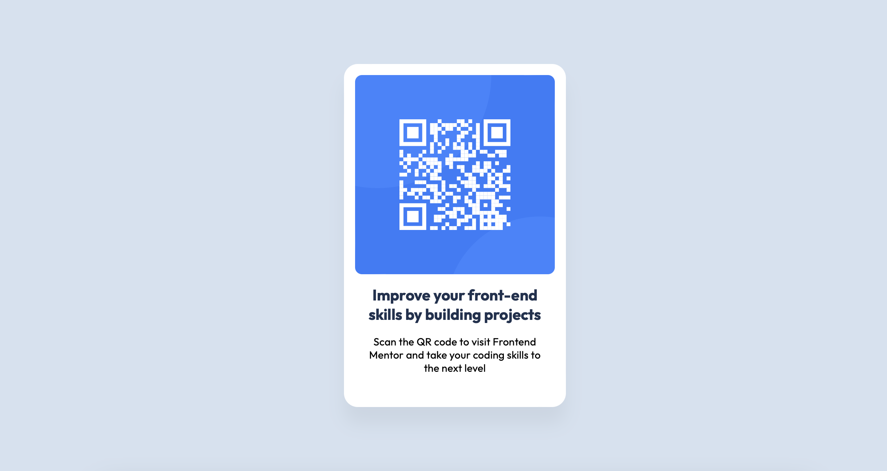

# Frontend Mentor - QR code component

## The challenge

The challenge is to build out this QR code component and get it looking as close to the design as possible.

### Built with

- Flexbox
- [React](https://reactjs.org/) - JS library

### What I learned

- I am learning React from SheCodes and implementing Frontend Mentor designs. This was a simple and easy design that I would recommend for beginners.

## Deployed your project

- [GitHub Pages](https://github.com/MundiaNderi/QR-code-component)
- [Netlify](https://steady-tulumba-cc37f9.netlify.app)
